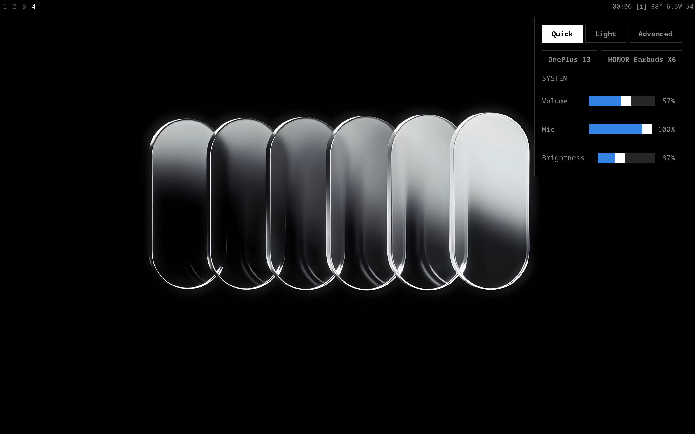
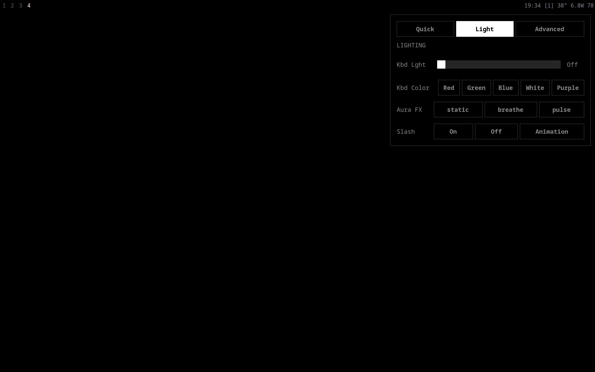
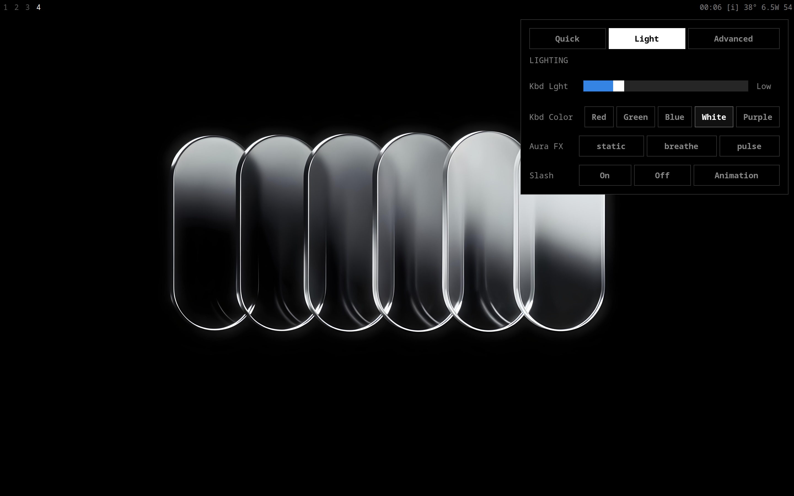

<h1 align="center">☁️ Sway Dotfiles</h1>

<p align="center">A clean, functional Linux setup centered around <b>Sway</b>.</p>

<div align="center">


</div>

## 📸 Overview

<details open>
<summary><b>Click to expand screenshots</b></summary>

| Clean Desktop | Tiled Windows |
| :---: | :---: |
|  |  |

| Terminal | App Launcher |
| :---: | :---: |
|  |  |

| Clipboard Manager | Power Menu |
| :---: | :---: |
|  |  |

| Control Center (Quick Settings) | Control Center (Advanced Settings) |
| :---: | :---: |
|  |  |

| Light |  |
| :---: | :---: |
|  | |

</details>

## ✨ Features

- **Window Manager**: [Sway](https://swaywm.org/) - A dynamic tiling Wayland compositor that's a drop-in replacement for i3.
- **Terminal Emulator**: [Ghostty](https://github.com/mitchellh/ghostty) - A fast, feature-rich, and modern Wayland terminal emulator.
- **Application Launcher**: [Tofi](https://github.com/philj56/tofi) - A very fast and simple dmenu/rofi replacement for Wayland.
- **Shell**: [Fish](https://fishshell.com/) - With custom prompts, frozen key bindings, and useful aliases.
- **Control Center**: [AGS](https://github.com/Aylur/ags) - A heavily customized GTK4/Astal widget providing a centralized hub for ASUS hardware controls (Aura, Slash lighting, Power profiles), Media playback, and system toggles.
- **System Fetch**: [Fastfetch](https://github.com/fastfetch-cli/fastfetch)
- **Bar/OSD**: [Wob](https://github.com/francma/wob) - A lightweight overlay volume/backlight/progress/anything bar for Wayland.

## ⚙️ Structure

```text
.
├── ags/          # Custom Control Center (GTK4/Astal)
├── bin/          # Custom scripts and binaries
├── fastfetch/    # Fastfetch config
├── fish/         # Fish shell config and functions
├── ghostty/      # Ghostty terminal config
├── nano/         # Nano editor config
├── sway/         # Sway configs and scripts
├── swaylock/     # Swaylock configuration
├── tofi/         # Tofi menus (app launcher, wifi, power)
├── wallpapers/   # System wallpapers
└── wob/          # Wob (overlay bar) configuration
```

## 🛠️ Utilities
- `tofi-wifi.sh`, `tofi-bluetooth.sh`, `tofi-slash.sh`: Tofi-based GUIs to easily connect to networks, bluetooth devices, and set ASUS Slash lighting animations.
- `pack_workspaces.py`: Custom script to organize Sway workspaces.
- `smart_clipboard.sh`: Quick clipboard management via wl-clipboard and tofi.

## 🚀 Installation
*(Assuming Arch Linux / Pacman-based distribution)*

1. Ensure the core packages are installed (`sway`, `swaylock`, `ghostty`, `fish`, `tofi`, `fastfetch`, `wob`, `wl-clipboard`, `ags`).
2. Clone this repository into your `~/.config` or use the included `ricesync` script from `bin/` to sync the dotfiles.
3. Reload Sway.

> **Note**: This config relies on certain system tools like `brightnessctl`, `playerctl`, `nmcli`, `bluetoothctl`, and `wpctl`. The AGS control center specifically relies on `asusctl`, `supergfxctl`, and `ryzenadj` for deep ASUS hardware integration.
